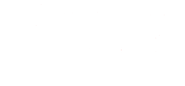

# Game Title

 <!-- Optional: Add a logo or banner image -->

**Burn The Concrete Sky** is a cyberpunk-fantasy top-down roguelike game developed by CzartB. After humanity destroyed itself, they are forced to live under the oppressive roof of Arktol, the last city. Your mission is to burn it all down!

---

## How to Play

- **Objective**: Topple Alaric's rule
- **Gameplay**: players will play as one of several playable characters. They will go through rooms of combat gauntlets, and get money which they can use to buy weapons and abilities. In the end of each stage, the player will face a boss. There will also be permadeath.

---

## Acknowledgments

- **Assets**: 
  - Dafont
  - Zapsplat
- **Inspiration**: 
  - OTXO
  - Warhammer 40K
  - Ultrakill
  - Shadowrun
  - Cyberpunk 2077
  - many more

---

**Enjoy playing!** 🎮

---
